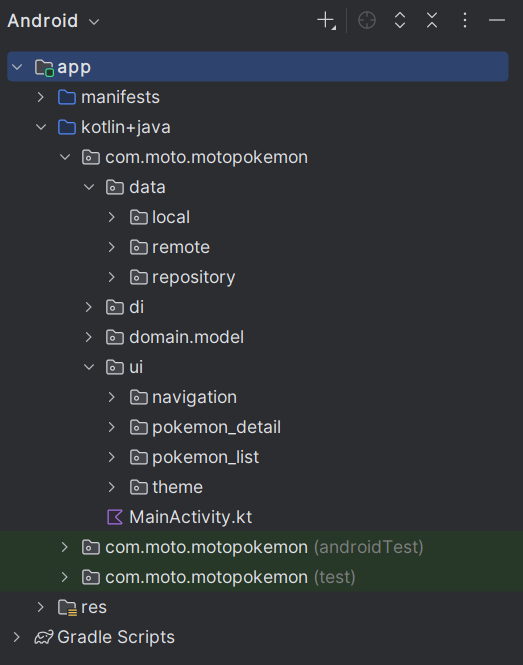

# 🧪 Teste Prático Android (Kotlin + Jetpack Compose) com PokeAPI

Este teste tem como objetivo avaliar conhecimentos básicos a intermediários em **Kotlin**, **Android**, **Jetpack Compose** e **consumo de APIs REST**.  
O teste está dividido em **três níveis de dificuldade**, permitindo que o candidato implemente apenas um nível ou todos, conforme desejar.

---

## ✅ Etapas Iniciais (obrigatórias para qualquer nível)

1. Faça um **fork deste repositório** para o seu GitHub como **privado**
2. Adicione os usuários abaixo como colaboradores:
   - `@fabiomotiws`
   - `@thfmart`
   - `@rossanez`
3. Crie um **novo projeto Android** utilizando:
   - **Linguagem:** Kotlin
   - **UI:** Jetpack Compose
   - **Min SDK:** 24 ou superior
4. Utilize a **PokeAPI** como fonte de dados
5. Crie um arquivo **README.md** contendo:
   - Funcionalidades implementadas
   - Como rodar o projeto
   - Arquitetura utilizada (ex: MVVM)
   - Bibliotecas utilizadas
6. O app deve **buildar e rodar corretamente em Android**

---

## 📚 Referência da API

A API utilizada neste teste é a **PokeAPI**.

| Recurso | Endpoint base | Exemplo |
|------|--------------|--------|
| Lista de Pokémons | `/api/v2/pokemon` | https://pokeapi.co/api/v2/pokemon |
| Detalhes do Pokémon | `/api/v2/pokemon/{name}` | https://pokeapi.co/api/v2/pokemon/pikachu |
| Tipos | `/api/v2/type` | https://pokeapi.co/api/v2/type/electric |
| Habilidades | `/api/v2/ability` | https://pokeapi.co/api/v2/ability/1 |

📎 Documentação completa:  
https://pokeapi.co/docs/v2

---

## 🧩 Arquitetura Recomendada

O projeto deve seguir o padrão **MVVM (Model–View–ViewModel)**, com separação clara de responsabilidades.

### Estrutura sugerida de pastas (Nomes ilustrativos :) )

com.moto.pokemonapp

---

## 📦 Bibliotecas Sugeridas

### Obrigatórias
- Retrofit
- Gson ou Kotlinx Serialization
- Jetpack Compose
- Navigation Compose
- ViewModel

### Opcionais (bônus)
- Hilt (Dependency Injection)
- Room (cache local)
- Kotlin Coroutines
- Flow / StateFlow
- Coil (carregamento de imagens)

---

## 🔸 Nível 1 — level_1 (Básico)

### Requisitos
- Realizar todas as etapas iniciais
- Exibir uma **lista de Pokémons** contendo:
  - Imagem
  - Nome
- Ao clicar em um Pokémon, navegar para a **tela de detalhes**, exibindo:
  - Imagem
  - Nome
  - Altura
  - Peso

---

## 🔸 Nível 2 — level_2 (Intermediário)

### Requisitos
Tudo do **Nível 1**, mais:

- Armazenar localmente em **cache** as consultas feitas à API
- Criar um **filtro por nome** na listagem
- Na tela de detalhes, exibir também:
  - Tipos
  - Habilidades

---

## 🔸 Nível 3 — level_3 (Avançado)

### Requisitos
Tudo do **Nível 2**, mais:

- Criar uma **Splash Screen customizada**
- Limpar o cache ao **fechar o app**
- Implementar **paginação** na listagem
- Ao clicar em um **tipo ou habilidade**, exibir a lista de Pokémons relacionados
- Permitir navegação para os detalhes dos Pokémons relacionados
- Criar **testes unitários** para regras de negócio

---

## 💎 Pontos Extras (Opcional)

- Utilizar Hilt para injeção de dependências
- Utilizar Flow ou StateFlow para gerenciamento de estado
- Detectar mudança de conexão (online/offline)
- Exibir mensagem quando estiver offline
- Arquitetura bem definida e código limpo

---

## 💡 Boas Práticas

- Commits frequentes e descritivos
- Criar branches separadas por nível:
  - `level_1`
  - `level_2`
  - `level_3`
- Evoluir o projeto utilizando Pull Requests
- Priorizar organização, legibilidade e boas práticas de Kotlin

---

## 🎯 Objetivo do Exercício

Nivelar:
- Conhecimento em Kotlin
- Consumo de APIs REST
- Uso de Jetpack Compose
- Arquitetura MVVM
- Organização de código
- Boas práticas Android
- Seja criativo(a), mas evite cópias ou uso de IA — nós vamos perceber 😎

O mais importe!
Boa sorte e divirta-se! :D
